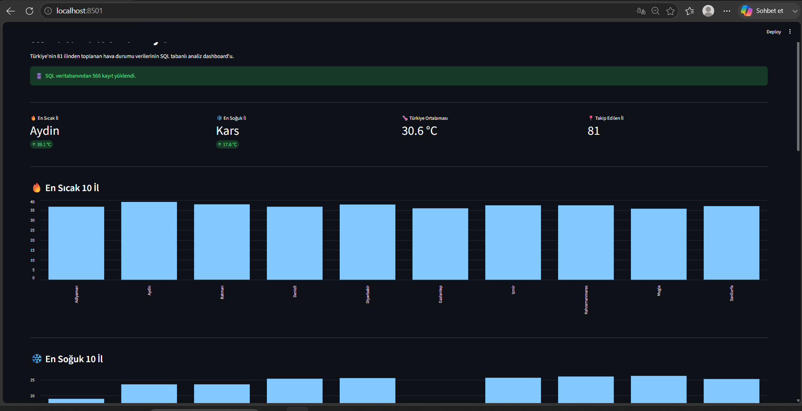

# 🌡️ DataPulse Türkiye



DataPulse Türkiye, Türkiye'nin 81 ilinden gerçek hava durumu verilerini toplayan, işleyen, SQL veritabanında saklayan ve interaktif bir dashboard üzerinden analiz eden uçtan uca bir veri projesidir.

## 🚀 Proje Mimarisi

```text
Open-Meteo API
      ↓
Python ETL Pipeline
      ↓
Retry Mechanism
      ↓
SQLite / SQL
      ↓
Data Quality Checks
      ↓
Historical Data
      ↓
Pandas Analysis
      ↓
Streamlit Dashboard
      ↓
Hourly Automation
```

## ✨ Özellikler

- 🇹🇷 Türkiye'nin 81 ilinden hava durumu verisi toplama
- 🌐 Open-Meteo API entegrasyonu
- ⚙️ Python tabanlı ETL pipeline
- 🔁 API hatalarında otomatik Retry sistemi
- 🗄️ SQLite veritabanında veri saklama
- 🔎 SQL sorguları ile veri analizi
- 🐼 Pandas ile veri işleme
- ✅ Data Quality kontrolleri
- 📈 Historical / Time-Series veri analizi
- 🔥 En sıcak ve en soğuk şehir analizi
- 📊 En sıcak ve en soğuk 10 şehir
- 🗺️ Türkiye sıcaklık haritası
- 🔎 Şehir bazlı sıcaklık geçmişi
- 🖥️ Streamlit interaktif dashboard
- ⏰ Windows Task Scheduler ile saatlik otomatik veri toplama

## 🛠️ Teknolojiler

| Teknoloji | Kullanım |
|---|---|
| Python | ETL ve ana uygulama |
| Requests | API istekleri |
| Open-Meteo API | Hava durumu verileri |
| SQLite | Veritabanı |
| SQL | Veri sorgulama |
| Pandas | Veri analizi |
| Matplotlib | Görselleştirme |
| Streamlit | Dashboard |
| Git & GitHub | Versiyon kontrolü |
| Windows Task Scheduler | Saatlik otomasyon |

## 🔄 ETL Pipeline

### Extract
Open-Meteo API üzerinden Türkiye'nin 81 ilinin sıcaklık verileri alınır.

### Transform
API'den gelen veriler şehir, koordinat, zaman ve sıcaklık formatında işlenir.

### Load
İşlenen veriler SQLite veritabanındaki `weather` tablosuna kaydedilir.

Eski kayıtlar korunarak zaman içerisinde historical dataset oluşturulur.

## 🔁 Retry Mekanizması

Bir API isteği geçici olarak başarısız olursa sistem otomatik olarak tekrar dener.

Bu sayede tek bir şehirde oluşan bağlantı problemi tüm pipeline'ın durmasına neden olmaz.

## ✅ Data Quality

Pipeline üzerinde:

- Eksik veri kontrolü
- Anormal sıcaklık kontrolü
- 81 il kontrolü
- Duplicate kayıt kontrolü

uygulanmaktadır.

Başarılı kontrolde:

```text
DATA QUALITY CHECK PASSED
```

sonucu alınır.

## 📊 Dashboard

Dashboard üzerinden:

- Güncel 81 il sıcaklığı
- En sıcak il
- En soğuk il
- Türkiye sıcaklık ortalaması
- En sıcak 10 il
- En soğuk 10 il
- Türkiye haritası
- Şehir bazlı sıcaklık geçmişi
- Time-Series grafikleri

incelenebilir.

## ▶️ Kurulum

Gerekli Python paketlerini yükleyin:

```bash
pip install -r requirements.txt
```

ETL pipeline'ı çalıştırın:

```bash
python main.py
```

Dashboard'u başlatın:

```bash
streamlit run dashboard.py
```

Data Quality kontrolünü çalıştırın:

```bash
python data_quality.py
```

## 📂 Proje Yapısı

```text
DataPulseV2/
│
├── main.py
├── dashboard.py
├── analysis.py
├── queries.py
├── database.py
├── data_quality.py
├── cities.csv
├── requirements.txt
├── dashboard.png
└── README.md
```

## 🎯 Projenin Amacı

Bu projede uçtan uca bir veri mühendisliği sürecinin temel bileşenleri uygulanmıştır:

**Data Collection → ETL → Retry → SQL → Data Quality → Historical Data → Analysis → Visualization → Automation**

Proje ilerleyen aşamalarda PostgreSQL, Docker, Cloud ve veri orkestrasyon araçlarıyla geliştirilebilir.